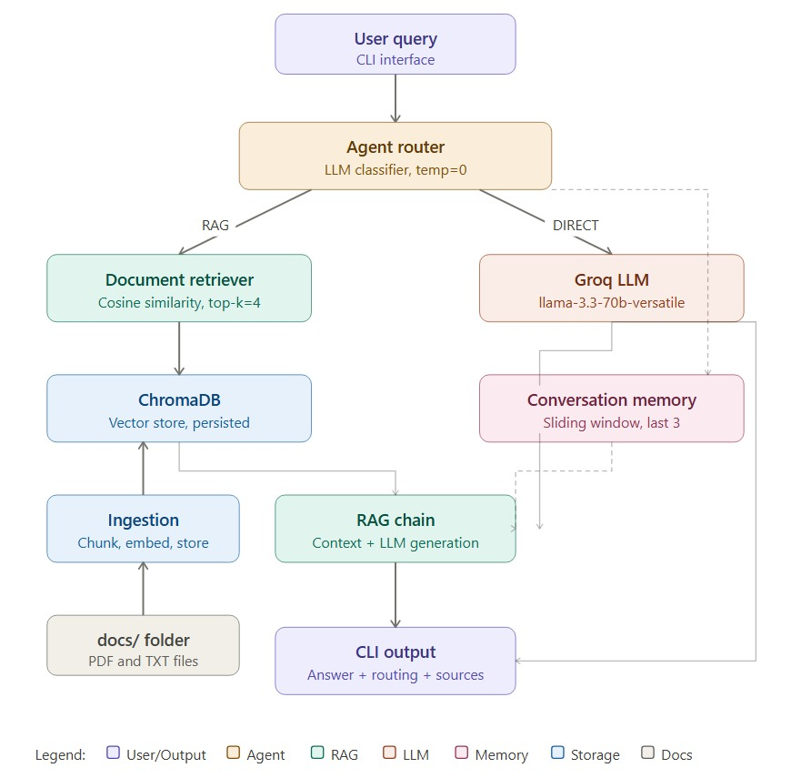

# Agentic RAG System

A production-style Retrieval-Augmented Generation (RAG) system with agentic 
routing built with LangChain, ChromaDB, and Groq (free LLM).

---

## What it does

- Loads your documents and stores them in a vector database
- When you ask a question, it **decides** whether to search the documents or answer directly
- Maintains memory of last 3 conversations for follow-up questions
- Shows you exactly what decision it made and which sources it used

---

## Architecture



---

## Project Structure
```
agentic_rag/
├── main.py                  # Entry point
├── config.py                # All configuration
├── requirements.txt         # Dependencies
├── .env                     # Your API key (not committed)
├── rag/
│   ├── ingestion.py         # Load → chunk → embed → store
│   ├── retriever.py         # Search relevant chunks
│   └── chain.py             # Generate answers with LLM
├── agent/
│   ├── decision.py          # Decide RAG vs DIRECT
│   └── orchestrator.py      # Connect everything
├── memory/
│   └── conversation.py      # Remember last 3 conversations
├── cli/
│   └── interface.py         # Interactive CLI
├── utils/
│   └── logging_setup.py     # Logging
└── docs/                    # Put your documents here
```

---

## Setup Instructions

### 1. Clone the repository
```bash
git clone https://github.com/YOUR_USERNAME/agentic-rag-system.git
cd agentic-rag-system
```

### 2. Create virtual environment
```bash
python -m venv .venv

# Mac/Linux
source .venv/bin/activate

# Windows
.venv\Scripts\activate
```

### 3. Install dependencies
```bash
pip install -r requirements.txt
pip install langchain-huggingface sentence-transformers langchain-groq
```

### 4. Set up API key
Create a `.env` file:

GROQ_API_KEY=your_groq_api_key_here

Get your free Groq API key at: https://console.groq.com

### 5. Add your documents
Place your PDF or `.txt` files inside the `docs/` folder.

### 6. Run
```bash
python main.py
```

> ⚠️ **Note:** First run will download the embedding model (~90MB). This is normal and only happens once! Subsequent runs will be much faster.

---

## CLI Commands

| Command | Description |
|---|---|
| `/ingest <path>` | Ingest a file or directory |
| `/status` | Show number of stored chunks |
| `/reset` | Clear conversation memory |
| `/help` | Show all commands |
| `/quit` | Exit |

---

## Example Session
```
You ▶ What is RAG?
│  RAG stands for Retrieval Augmented Generation. It combines
│  document search with LLM generation to give grounded answers.
├─ Metadata
│  Routing     : RAG
│  Retrieval   : Yes
│  Sources     : sample.txt

You ▶ What is the capital of France?
│  The capital of France is Paris.
├─ Metadata
│  Routing     : DIRECT
│  Retrieval   : No
│  Sources     : —

You ▶ Tell me more about that
│  (uses memory of previous exchange)
├─ Metadata
│  Routing     : DIRECT
│  Retrieval   : No
│  Sources     : —
```

---

## Design Decisions

### 1. LLM-based routing (not keyword matching)
Used an LLM classifier with `temperature=0` to decide RAG vs DIRECT.
This handles paraphrasing and follow-up questions correctly — something
keyword matching can't do. Falls back to RAG if unsure — better to
retrieve unnecessarily than miss relevant context.

### 2. Chunk size of 1000 with overlap of 150
Chunk size of 1000 characters balances context richness and retrieval
precision. The overlap of 150 ensures no information is lost at chunk
boundaries. Smaller chunks improve retrieval accuracy but lose context,
larger chunks reduce precision.

### 3. Top-k retrieval of 4 chunks
Retrieving 4 chunks gives enough context without overwhelming the LLM
prompt. Too few chunks miss relevant information, too many add noise
and increase hallucination risk.

### 4. ChromaDB for vector storage
ChromaDB was chosen because it supports local persistence with no
external server needed, integrates natively with LangChain, and is
lightweight enough for development and testing.

### 5. HuggingFace embeddings (free, local)
Used `sentence-transformers/all-MiniLM-L6-v2` — completely free,
runs locally, no API key needed. Good balance of speed and accuracy
for semantic search.

### 6. Groq as LLM provider (free)
Groq provides free, fast inference for open-source models. Used
`llama-3.3-70b-versatile` which is powerful enough for RAG tasks
without any cost.

### 7. Sliding window memory with deque
Used Python's `deque(maxlen=window*2)` for O(1) append and automatic
eviction. Keeps last 3 conversation pairs — enough for follow-up
context without overloading the prompt.

### 8. Prompt injection defence
Retrieved context is wrapped in `<context>` XML tags with explicit
system instruction to treat it as data only — protects against
malicious content in documents.

---

## Limitations

### Current limitations:
- **Memory resets on restart** — conversation history is in-memory only.
  Production fix: persist to Redis or a database.

- **No confidence scoring** — the router returns RAG or DIRECT but
  doesn't provide a confidence score. Could misclassify ambiguous queries.

- **No reranking** — chunks are retrieved by cosine similarity only.
  Adding a cross-encoder reranker would improve precision.

- **No context summarization** — long conversations may exceed the LLM
  context window. Fix: summarize older turns instead of dropping them.

- **Retrieval depends on embedding quality** — if the query is phrased
  very differently from the document, retrieval may miss relevant chunks.

- **Single user only** — no session management for multiple concurrent users.

- **No ingestion deduplication** — re-ingesting the same file adds
  duplicate chunks to ChromaDB.

### Edge cases handled:
- ✅ No chunks retrieved → falls back to direct LLM answer
- ✅ Unexpected router output → defaults to RAG safely
- ✅ Empty user input → ignored, prompts again
- ✅ Keyboard interrupt → exits gracefully

---

## Tech Stack

| Tool | Purpose |
|---|---|
| LangChain | RAG pipeline framework |
| ChromaDB | Vector database |
| Groq | Free LLM API |
| HuggingFace | Free embeddings |
| Python 3.11 | Language |

---